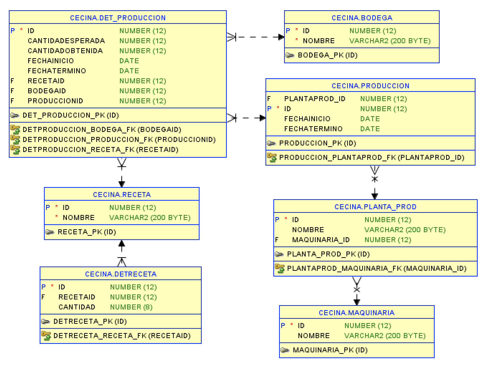
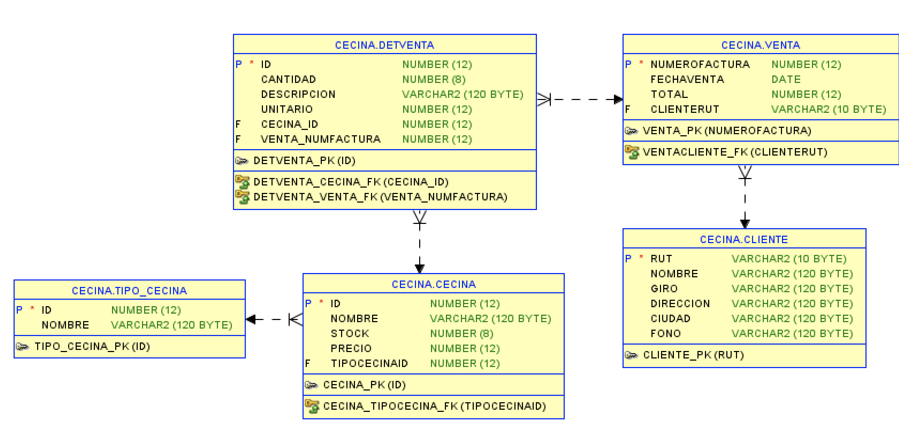
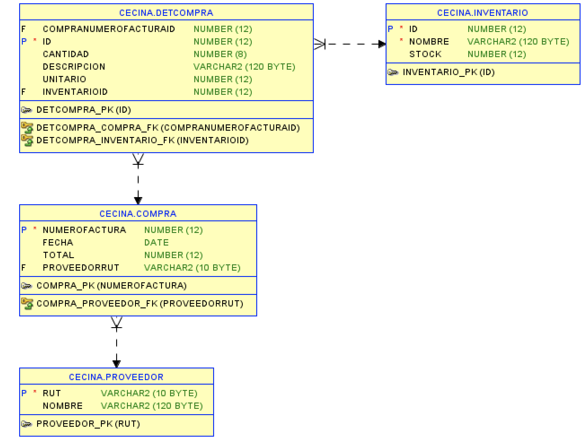

# Sistema de Gestión de Cecinas

## Descripción del Negocio

El sistema de gestión de Cecinas está diseñado para manejar todos los aspectos operativos de una empresa que produce y vende cecinas (embutidos). Este sistema abarca desde la producción en la planta hasta la venta a los clientes, gestionando eficientemente el inventario, la maquinaria utilizada en la producción, las recetas de los productos, y las ventas finales a los clientes.

### Estructura del Negocio

El negocio de Cecinas se organiza en varias áreas clave:

1. **Empresas**: Gestiona los datos de las distintas empresas relacionadas con la producción y venta de cecinas.

2. **Maquinaria**: Administra la maquinaria utilizada en las plantas de producción, asegurando que cada planta esté equipada con los recursos necesarios para la producción.

3. **Bodegas**: Controla las diferentes bodegas donde se almacenan tanto los insumos como los productos terminados.

4. **Recetas**: Almacena las recetas utilizadas en la fabricación de los distintos tipos de cecinas, incluyendo los ingredientes y cantidades necesarias.

5. **Plantas de Producción**: Gestiona las plantas donde se llevan a cabo las operaciones de producción, vinculadas con la maquinaria específica que utilizan.

6. **Producción**: Administra los lotes de producción, incluyendo fechas de inicio y término, y la cantidad de producto esperada versus la obtenida.

7. **Inventario**: Controla el stock de insumos y productos terminados disponibles en las bodegas.

8. **Clientes y Ventas**: Administra los clientes y registra las ventas realizadas, asegurando un seguimiento detallado de las facturas emitidas y los productos vendidos.

9. **Proveedores y Compras**: Gestiona los proveedores de insumos y las compras realizadas a estos, asegurando la disponibilidad de materiales para la producción.

### Modelo de Base de Datos

El modelo de base de datos del sistema de Cecinas incluye las siguientes tablas:

- `empresa`
- `maquinaria`
- `bodega`
- `receta`
- `planta_prod`
- `produccion`
- `det_produccion`
- `detReceta`
- `inventario`
- `cliente`
- `tipo_cecina`
- `cecina`
- `proveedor`
- `venta`
- `detVenta`
- `compra`
- `detCompra`

Cada una de estas tablas está relacionada para garantizar la integridad de los datos y permitir un seguimiento completo de las operaciones desde la producción hasta la venta.

### Integridad Referencial

El sistema garantiza la integridad referencial mediante el uso de claves foráneas, con reglas de eliminación en cascada (`ON DELETE CASCADE`) para asegurar que los datos relacionados se mantengan consistentes y sin errores.

### Ejemplo de Funcionamiento

1. **Producción**: Se inicia un proceso de producción utilizando una receta específica en una planta de producción. Los insumos se retiran del inventario, y al final del proceso, los productos terminados se almacenan en las bodegas correspondientes.

2. **Ventas**: Los productos terminados se venden a los clientes. Cada venta se registra con un detalle preciso de los productos vendidos y las cantidades.

3. **Compras**: Se realizan compras de insumos a los proveedores para mantener el inventario adecuado para la producción.

## DIAGRAMAS

